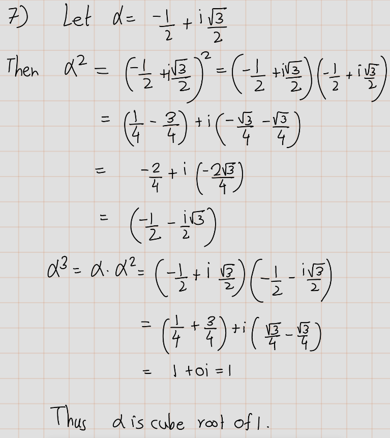

# Exercise 1A

1. Show that $\alpha + \beta = \beta + \alpha$ for all $\alpha, \beta \in \mathbb{C}$.

```{r echo=FALSE}
  knitr::include_graphics('fig/Ex1A/Ex1.png') 
```

2. Show that $(\alpha + \beta) + \lambda = \alpha + (\beta + \lambda)$ for all $\alpha, \beta, \lambda \in \mathbb{C}$.

```{r echo=FALSE}
  knitr::include_graphics('fig/Ex1A/Ex2.png') 
```

3. Show that $(\alpha \beta)\lambda = \alpha(\beta \lambda)$ for all $\alpha, \beta, \lambda \in \mathbb{C}$.


4. Show that $\lambda(\alpha + \beta) = \lambda\alpha + \lambda\beta$ for all $\lambda, \alpha, \beta \in \mathbb{C}$.

```{r echo=FALSE}
  knitr::include_graphics('fig/Ex1A/Ex4.png') 
```

5. Show that for every $\alpha \in \mathbb{C}$, there exists a unique $\beta \in \mathbb{C}$ such that $\alpha + \beta = 0$.

```{r echo=FALSE}
  knitr::include_graphics('fig/Ex1A/Ex5.png') 
```

6. Show that for every $\alpha \in \mathbb{C}$ with $\alpha \neq 0$, there exists a unique $\beta \in \mathbb{C}$ such that $\alpha\beta = 1$.

```{r echo=FALSE}
   
```

7. Show that $\frac{-1 + \sqrt{3}i}{2}$ is a cube root of 1 (meaning that its cube equals 1).

```{r echo=FALSE}
   
```

8. Find two distinct square roots of $i$.

```{r echo=FALSE}
  knitr::include_graphics('fig/Ex1A/Ex8.png') 
```

9. Find $x \in \mathbb{R}^4$ such that $(4, -3, 1, 7) + 2x = (5, 9, -6, 8)$.

```{r echo=FALSE}
  knitr::include_graphics('fig/Ex1A/Ex9.png') 
```

10. Explain why there does not exist $\lambda \in \mathbb{C}$ such that $\lambda(2 - 3i, 5 + 4i, -6 + 7i) = (12 - 5i, 7 + 22i, -32 - 9i)$.

```{r echo=FALSE}
   
```

11. Show that $(x + y) + z = x + (y + z)$ for all $x, y, z \in \mathbb{F}_n$.

12. Show that $(ab)x = a(bx)$ for all $x \in \mathbb{F}_n$ and all $a, b \in \mathbb{F}$.
13. Show that $1x = x$ for all $x \in \mathbb{F}_n$.
14. Show that $\lambda(x + y) = \lambda x + \lambda y$ for all $\lambda \in \mathbb{F}$ and all $x, y \in \mathbb{F}_n$.
15. Show that $(a + b)x = ax + bx$ for all $a, b \in \mathbb{F}$ and all $x \in \mathbb{F}_n$. 