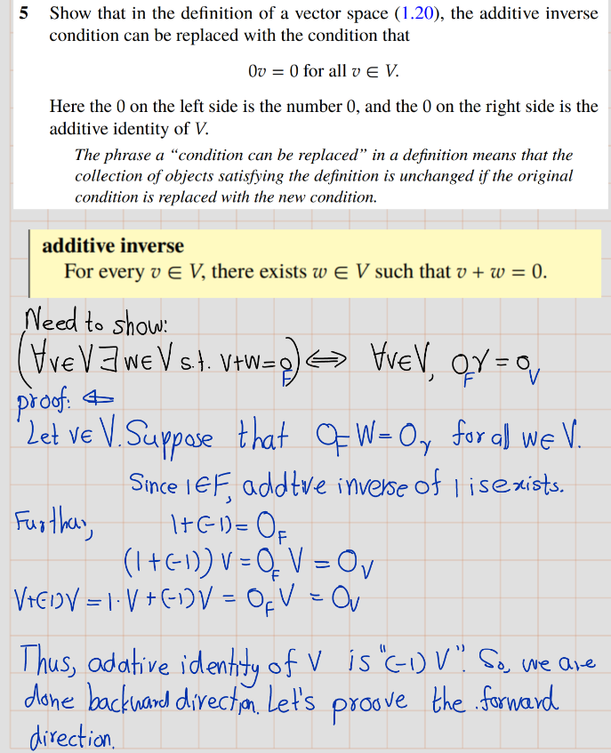
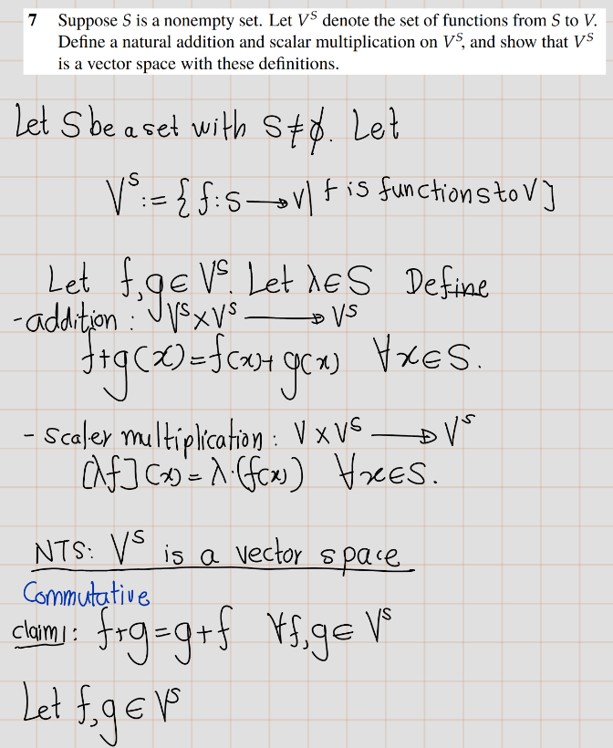
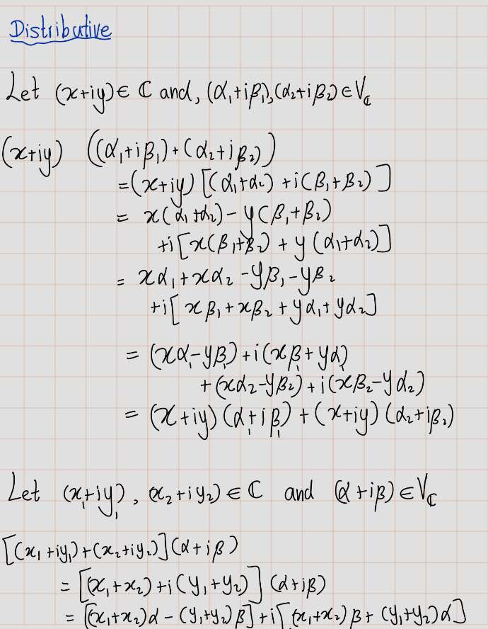
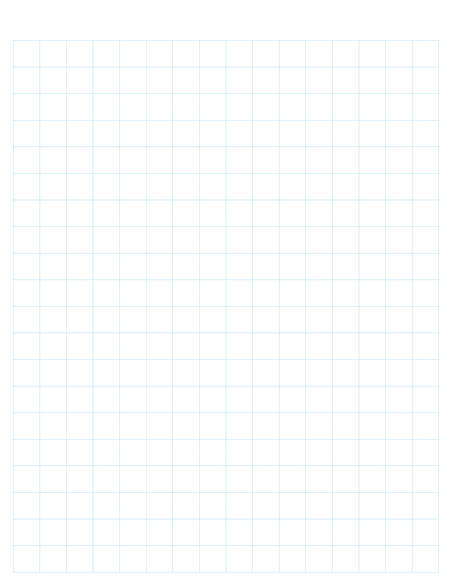

# Exercise
## Exercise 1A
1.  Show that \\(\\alpha + \\beta = \\beta + \\alpha\\) for all \\(\\alpha, \\beta \\in \\mathbb{C}\\).

2.  Show that \\((\\alpha + \\beta) + \\lambda = \\alpha + (\\beta + \\lambda)\\) for all \\(\\alpha, \\beta, \\lambda \\in \\mathbb{C}\\).

3.  Show that \\((\\alpha \\beta)\\lambda = \\alpha(\\beta \\lambda)\\) for all \\(\\alpha, \\beta, \\lambda \\in \\mathbb{C}\\).
    
4.  Show that \\(\\lambda(\\alpha + \\beta) = \\lambda\\alpha + \\lambda\\beta\\) for all \\(\\lambda, \\alpha, \\beta \\in \\mathbb{C}\\).
    

5.  Show that for every \\(\\alpha \\in \\mathbb{C}\\), there exists a unique \\(\\beta \\in \\mathbb{C}\\) such that \\(\\alpha + \\beta = 0\\).

6.  Show that for every \\(\\alpha \\in \\mathbb{C}\\) with \\(\\alpha \\neq 0\\), there exists a unique \\(\\beta \\in \\mathbb{C}\\) such that \\(\\alpha\\beta = 1\\).

7.  Show that \\(\\frac{-1 + \\sqrt{3}i}{2}\\) is a cube root of 1 (meaning that its cube equals 1).

8.  Find two distinct square roots of \\(i\\).

9.  Find \\(x \\in \\mathbb{R}^4\\) such that \\((4, -3, 1, 7) + 2x = (5, 9, -6, 8)\\).

10.  Explain why there does not exist \\(\\lambda \\in \\mathbb{C}\\) such that \\(\\lambda(2 - 3i, 5 + 4i, -6 + 7i) = (12 - 5i, 7 + 22i, -32 - 9i)\\).

11.  Show that \\((x + y) + z = x + (y + z)\\) for all \\(x, y, z \\in \\mathbb{F}\_n\\).
    
12.  Show that \\((ab)x = a(bx)\\) for all \\(x \\in \\mathbb{F}\_n\\) and all \\(a, b \\in \\mathbb{F}\\).
    
13.  Show that \\(1x = x\\) for all \\(x \\in \\mathbb{F}\_n\\).
    
14.  Show that \\(\\lambda(x + y) = \\lambda x + \\lambda y\\) for all \\(\\lambda \\in \\mathbb{F}\\) and all \\(x, y \\in \\mathbb{F}\_n\\).
    
15.  Show that \\((a + b)x = ax + bx\\) for all \\(a, b \\in \\mathbb{F}\\) and all \\(x \\in \\mathbb{F}\_n\\).
    

## Exercise 1B

1.  Prove that \\(−(−v) = v\\) for every \\(v\\in V\\). **Solution**: Let \\(v\\in V\\). Then there exist a unique additive inverse of \\(v\\). We denote it by \\(-v\\). Thus, \\\[v+(-v)=0.\\\] Then by definition, additive inverse of \\((-v)\\) is v. We denote it by \\(-(-v)=v\\).
    
2.  Suppose \\(a \\in \\mathbb{F} ,v\\in V\\), and \\(v= 0\\). Prove that \\(a=0\\) or \\(v=0\\).
    

3.  
    
    
    

5.  
    
    
    
6.  
    
7.  Suppose \\(S\\) is a non-empty set. Let \\(V^S\\) denote the set of functions from \\(S\\) to \\(V\\). Define a natural addition and scalar multiplication on \\(V^S\\), and show that \\(V^S\\) is a vector space with these definitions.
    

## Exercise 1C

1.  
    
    
    
    
    

**Statement 1**: If \\(b\\in \\mathbb{F}\\), then \\\[\\left\\{(x\_1,x\_2,x\_3,x\_4)\\in \\mathbb{F}^4:x\_3=5x\_4+b\\right\\}\\\] is a subspace of \\(\\mathbb{F}^4\\) if and only if \\(b = 0\\).

_Proof of Statement 1_

**Statement 2** : The set of continuous real-valued functions on the interval \\(\[0, 1\]\\) is a subspace of \\(\\mathbb{R}^\[0,1\]\\)

_Proof of statement 2_:

**Statement 3** : The set of differentiable real-valued functions on \\(\\mathbb{R}\\) is a subspace of \\(\\mathbb{R}^{\\mathbb{R}}\\).

_Proof of Statement 3_

**Statement 4** : The set of differentiable real-valued functions \\(\\mathbb{R}\\) on the interval (0, 3) such that \\(f'(2)=b\\) is a subspace of \\(\\mathbb{R}^{(0,3)}\\) if and only if \\(b = 0\\).

_Proof of Statement 4_

**Statement 5** : The set of all sequences of complex numbers with limit \\(0\\) is a subspace of \\(\\mathbb{C}^{\\infty}\\)

_Proof of Statement 5_:

3.    
    

4.    
 

5.    
 
 
  
  
  
  
  
  
  
  
  
  
  
  
  
  
  
  
  

