# Linear Maps Exercises

## Exercise 3A


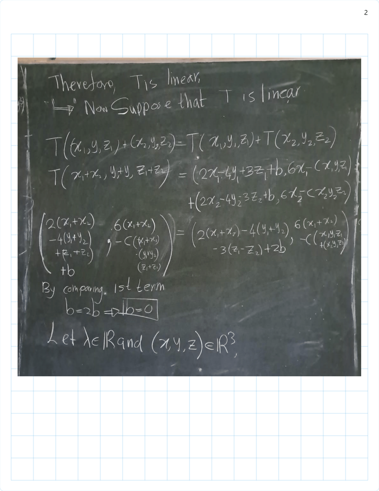
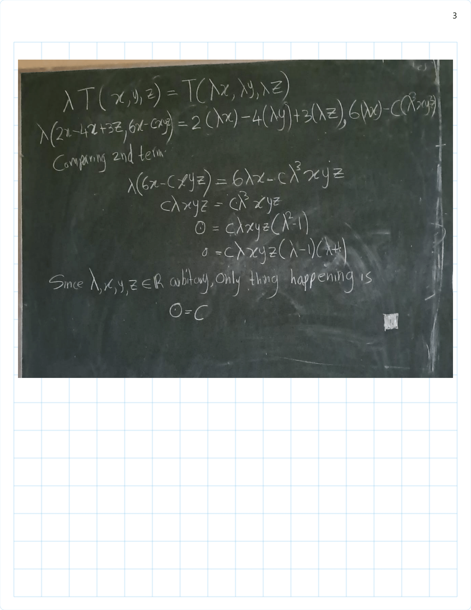
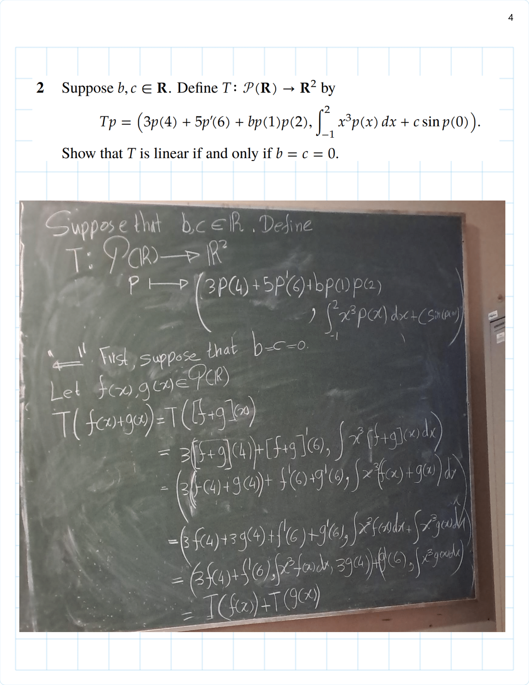
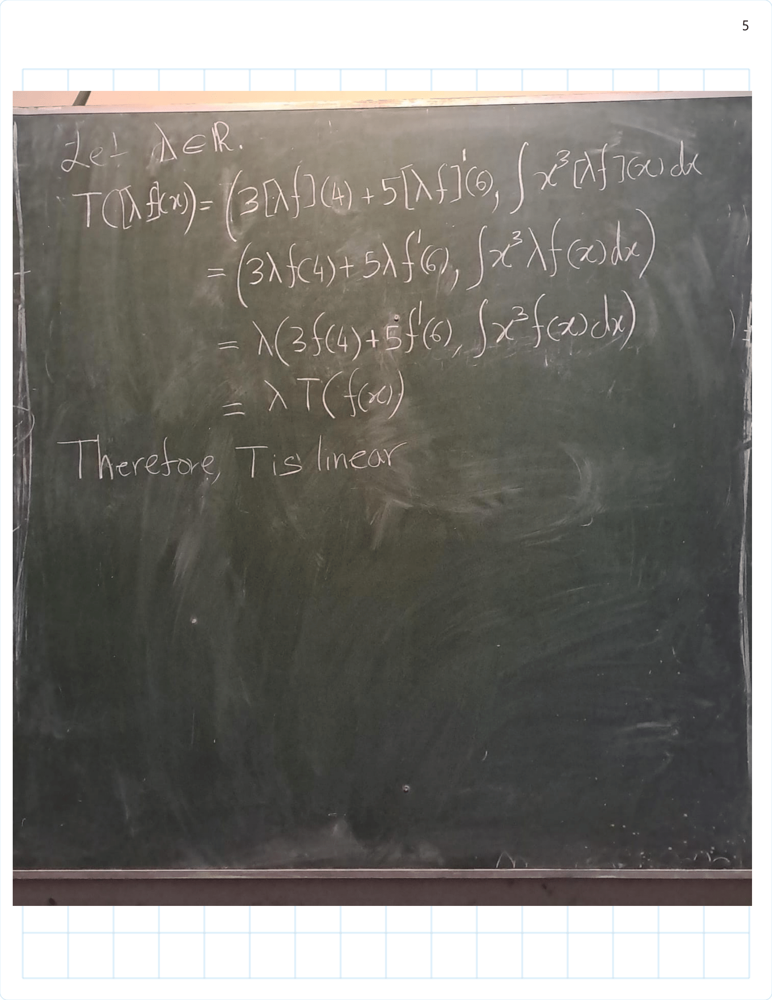
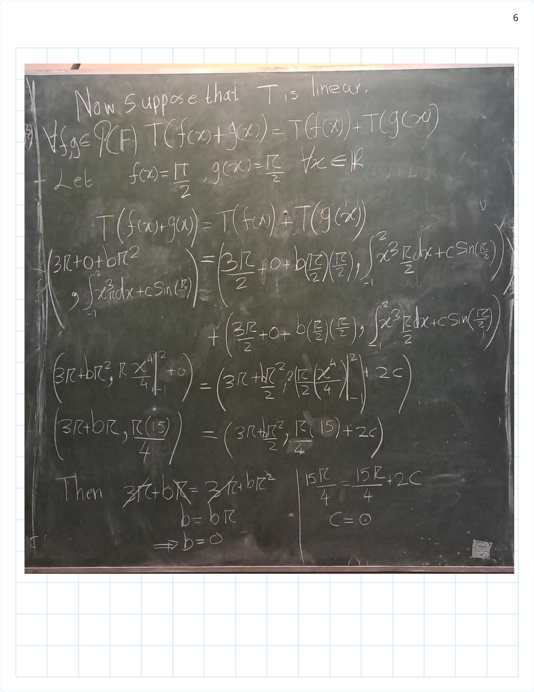


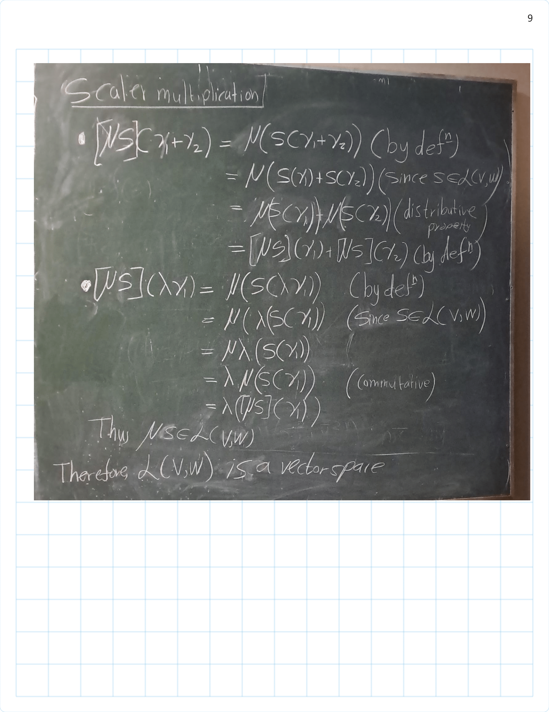
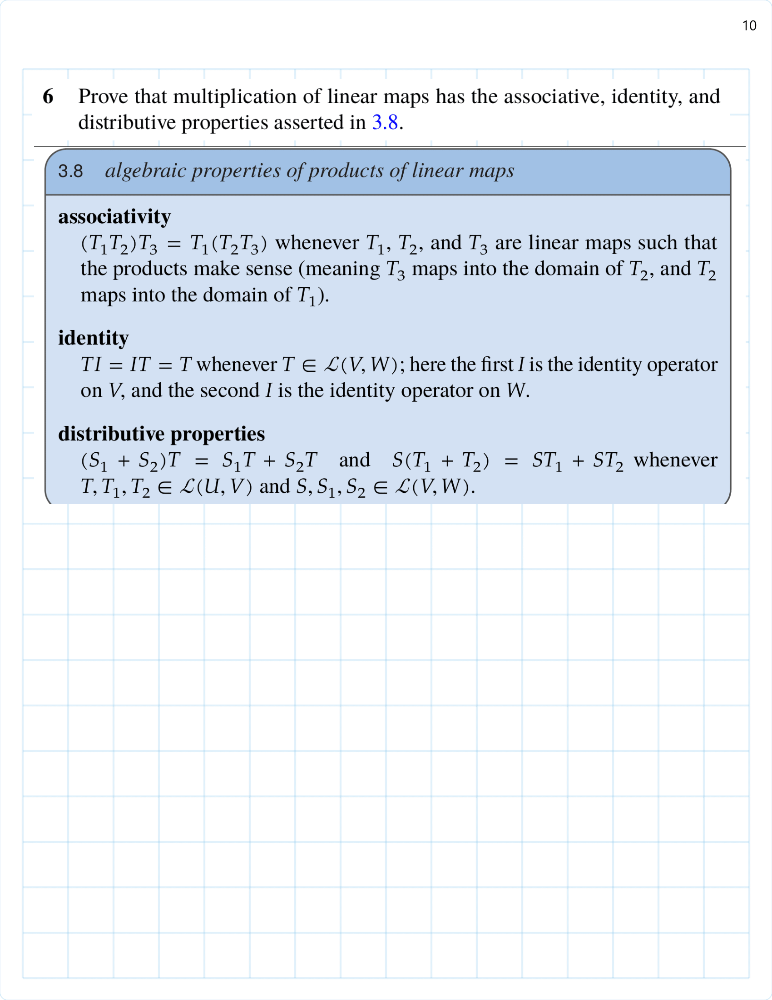


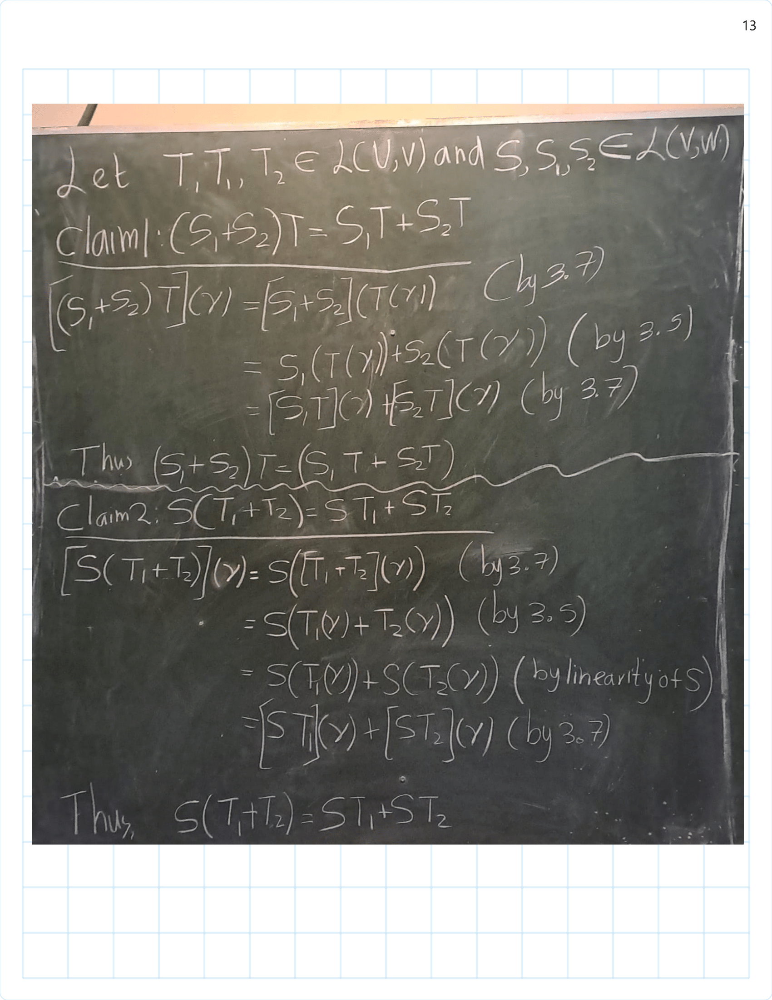

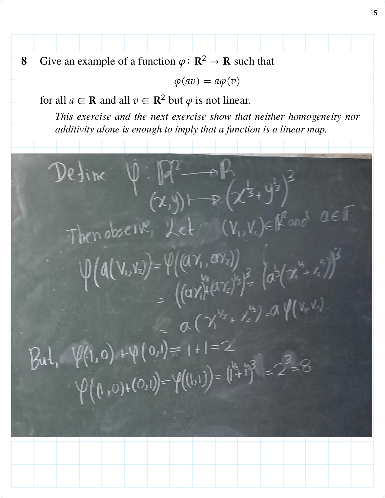


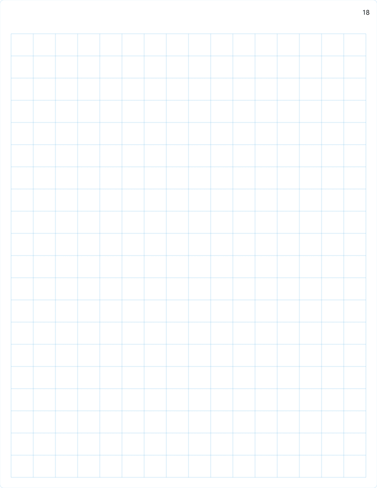
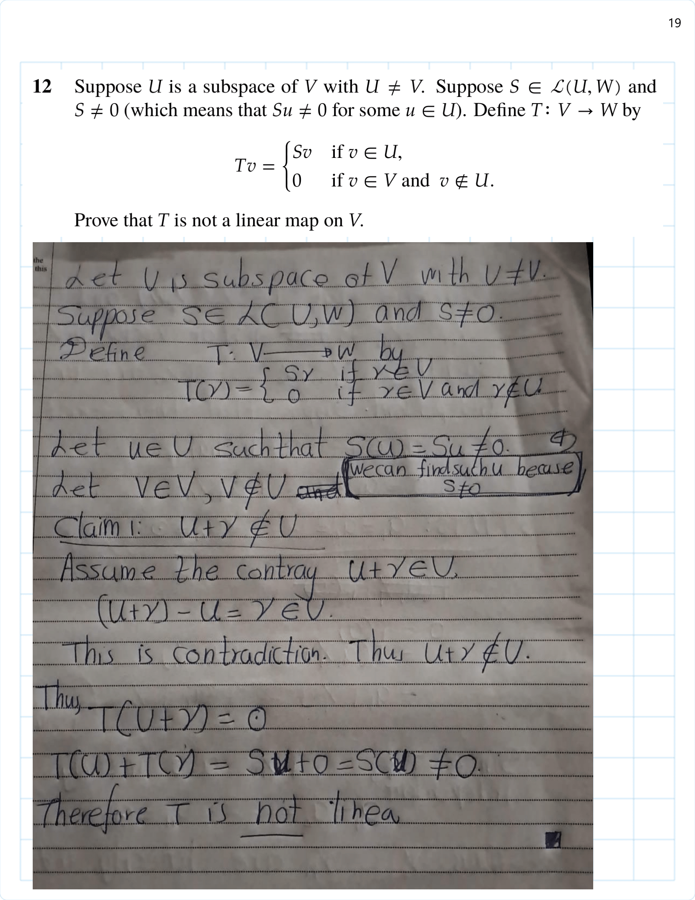

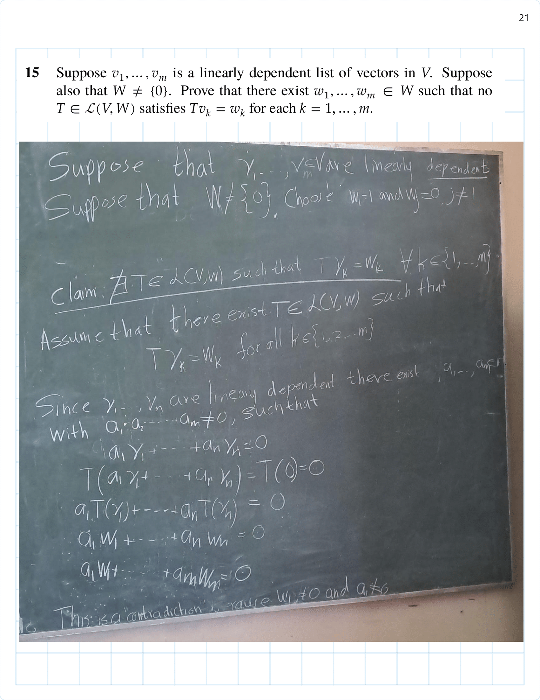


## Null Space and Injectivity

In this section we will learn about two subspaces that are intimately connected  with each linear map. We begin with the set of vectors that get mapped to $0$.

```{definition,name="null space"}
For $𝑇\in \mathcal{L}(𝑉,𝑊)$, the null space of $𝑇$, denoted by $\text{null}𝑇$, is the subset of $𝑉$ consisting of those vectors that $𝑇$ maps to $0$ (Notation $\text{null}T$):
 \[\text{null} 𝑇 = {𝑣 ∈ 𝑉 ∶ 𝑇𝑣 = 0}\]
```

## Exercise 3B


/Exercise 3B part(1)-01.png)
/Exercise 3B part(1)-01.png)
/Exercise 3B part(1)-02.png)
/Exercise 3B part(1)-03.png)
/Exercise 3B part(1)-04.png)
/Exercise 3B part(1)-05.png)
/Exercise 3B part(1)-06.png)
/Exercise 3B part(1)-07.png)
/Exercise 3B part(1)-08.png)
/Exercise 3B part(1)-09.png)
/Exercise 3B part(1)-10.png)
/Exercise 3B part(1)-11.png)
/Exercise 3B part(1)-12.png)
/Exercise 3B part(1)-13.png)
/Exercise 3B part(1)-14.png)
/Exercise 3B part(1)-15.png)
/Exercise 3B part(1)-16.png)
/Exercise 3B part(1)-17.png)
/Exercise 3B part(1)-18.png)
/Exercise 3B part(1)-19.png)
/Exercise 3B part(1)-20.png)
/Exercise 3B part(1)-21.png)
/Exercise 3B part(1)-22.png)

## Exercise 3C


## Exercise 3D