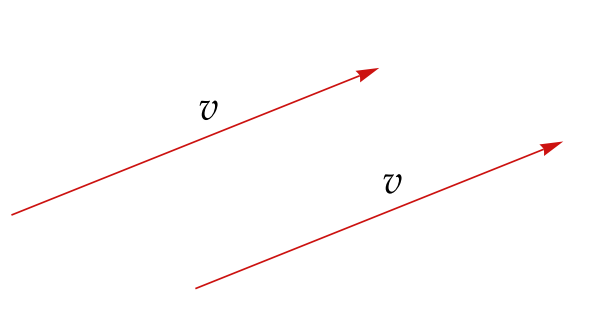

--- 
title: "Linear Algebra"
author: "Ashan Jayamal"
date: "`r Sys.Date()`"
site: bookdown::bookdown_site
documentclass: book
bibliography: [book.bib, packages.bib]
url: https://ashanjayamal.github.io/LinearAlgebra/
cover-image: cover.png
description: |
  Linear Algbra done right
link-citations: yes
favicon: favicon.ico
github-repo: rstudio/bookdown-demo
---

# Vector space
## R^n and C^n
$\mathbb{R}^n$ and $\mathbb{C}^n$


We are already be familiar with basic properties of the set  of real numbers($\mathbb{R}$). 

Some nonconstant polynomials with real coefficients have no real
zeros. 

**Example**: the equation
\[x^2+1=0\]
has no real solutions.
Thus we invent a solution, called \(i\), with the property that \(i^2 = -i\).

Futhur, complex numbers comes when we can take square roots of negative numbers. The idea is to assume we have a square root of $−1$, denoted by $i$ that obeys the usual rules of arithmetic. Here are the formal definition.

```{definition,name='Complex Numbers '}

- A complex number is an ordered pair $(x, y)$, where $x, y \in \mathbb{R}$, but we will write this as $x + yi$.
- The set of all complex numbers is denoted by $\mathbb{C}$:
\[\mathbb{C} = \{x + yi \,|\, x, y \in \mathbb{R}\}.\]
- Addition and multiplication on $\mathbb{C}$ are defined by
\[(x + yi) + (u + vi) = (x + u) + (y + v)i,\]
\[(x + yi)(u + vi) = (xu - yv) + (xv + yu)i;\]
here $x, y, u, v \in \mathbb{R}$

```

**Fun Fact**: The symbol $i$ was first used to denote $\sqrt{-1}$ by Leonard Euler in 1777.


- Note that $\mathbb{C} \supseteq \mathbb{R}$ because for all real numbers $a$  $\mathbb{R}$, we can express it as a complex number by writing it as $a + 0i$. 
- We usually denote $0 + yi$ simply as $yi$, and $0 + 1i$ as $i$.
- The definition of multiplication for complex numbers is based on the assumption that $i^2 = -1$. Using the standard arithmetic rules, we can derive the formula for the product of two complex numbers. This formula can then be used to confirm that $i^2$ indeed equals $-1$.

```{example}
Let's calculate the product of two complex numbers $(1 + 2i)$ and $(3 + 4i)$ using the distributive and commutative properties:

\begin{align*}
(1 + 2i)(3 + 4i) &= 1 \cdot (3 + 4i) + (2i)(3 + 4i) \\
&= 1 \cdot 3 + 1 \cdot 4i + 2i \cdot 3 + (2i)(4i) \\
&= 3 + 4i + 6i - 8 \\
&= -5 + 10i
\end{align*}
```

```{proposition,name='Properties of Complex Arithmetic'}

- **Commutativity**: $z_1 + z_2 = z_2 + z_1$ and $z_1z_2 = z_2z_1$ for all $z_1, z_2 \in \mathbb{C}$.
- **Associativity**: $(z_1 + z_2) + z_3 = z_1 + (z_2 + z_3)$ and $(z_1z_2)z_3 = z_1(z_2z_3)$ for all $z_1, z_2, z_3 \in \mathbb{C}$.
- **Identities**: $z + 0 = z$ and $z1 = z$ for all $z \in \mathbb{C}$.
- **Additive Inverse**: For every $z \in \mathbb{C}$, there exists a unique $-z \in \mathbb{C}$ such that $z + (-z) = 0$.
- **Multiplicative Inverse**: For every $z \in \mathbb{C}$ with $z \neq 0$, there exists a unique $z^{-1} \in \mathbb{C}$ such that $zz^{-1} = 1$.
- **Distributive Property**: $z_1(z_2 + z_3) = z_1z_2 + z_1z_3$ for all $z_1, z_2, z_3 \in \mathbb{C}$.
```

The properties above are proved using the familiar properties of real numbers and the definitions of complex addition and multiplication. Here, we are going to prove that commutativity of complex addition and multiplication is proved.

```{proof}
- _Addition_ : Let $z_1 = a + bi$ and $z_2 = c + di$ be any two complex numbers. Then we have:

   \[z_1 + z_2 = (a + bi) + (c + di) = (a + c) + (b + d)i = z_2 + z_1\]

   This shows that addition is commutative for complex numbers.

- _Multiplication_: Again, let $z_1 = a + bi$ and $z_2 = c + di$ be any two complex numbers. Then we have:

   \[z_1z_2 = (a + bi)(c + di) = ac + adi + bci - bd = (ac - bd) + (ad + bc)i\]
        and

   \[z_2z_1 = (c + di)(a + bi) = ca + cbi + dai - db = (ca - db) + (da + cb)i\]
     
As you can see, $(ac - bd) + (ad + bc)i = (ca - db) + (da + cb)i$, which shows that multiplication is also commutative for complex numbers.   

So, we have proved that both addition and multiplication are commutative operations in the set of complex numbers. This means that the order in which complex numbers are added or multiplied does not affect the result.

```

```{definition,name='Subtraction,Division'}

Let's suppose $z_1, z_2 \in \mathbb{C}$.

- The negative of a complex number $z_1$ is denoted as $-z_1$. It is the unique complex number such that $$z_1 + (-z_1) = 0.$$
- Subtraction in the set of complex numbers is defined as $$z_1 - z_2 = z_1 + (-z_2).$$
- For $z_1 \neq 0$, let $1/z_1$ denote the multiplicative inverse of $z_1$. Thus, $1/z_1$ is the unique complex number such that $$z_1(1/z_1) = 1.$$
- For $z_1 \neq 0$, division by $z_1$ is defined as $$z_2/z_1 = z_2(1/z_1).$$

```
So that we can conveniently make definitions and prove theorems that apply to both real and complex numbers, we adopt the following notation.

**Notation** :Throughout this note stands $\mathbb{F}$ for either $\mathbb{R}$  or $\mathbb{F}$. The letter $\mathbb{F}$ is used because $\mathbb{R}$ and $\mathbb{C}$ are examples of what are called fields.

Elements of $\mathbb{F}$  are called scalars. The word “scalar” (which is just a fancy word for “number”) is often used when we want to emphasize that an object is a number, as opposed to a vector (vectors will be defined soon).

For $\alpha \in \mathbb{F}$ and $m$ a positive integer, we define $\alpha^m$ to denote the product of $\alpha$ with itself $m$ times:
\[\alpha^m=\underbrace{\alpha\cdot \alpha \cdots \alpha}_{ m \text{times}}\].
This definition implies that
\[(\alpha^m)^n=\alpha^{mn}\quad \text {and} \quad(\alpha\beta)^m=\alpha^m\beta^m\]
for all $\alpha\beta\in \mathbb{F}$  and all positive integers $m,n$.

### Lists
Before defining $\mathbb{R}^n$ and $\mathbb{C}^n$, we look at two important examples.

```{example}
- The set $\mathbb{R}^2$ , which you can think of as a plane, is the set of all ordered pairs of real numbers:
  \[\mathbb{R}^2:=\{(x,y):x,y\in \mathbb{R}\}\]
- The set $\mathbb{R}^3$, which you can think of as ordinary space, is the set of all ordered triples of real numbers:
\[\mathbb{R}^3:=\{(x,y,z):x,y,z\in \mathbb{R}\}\]
```
Let's generalize this examples to higher dimensions. 

```{definition,name='List,Length'}
- Suppose $n$ is a nonnegative integer. A _list_ of _length_ $n$ is an ordered collection of $n$ elements (which might be numbers, other lists, or more abstract objects).
- Two lists are equal if and only if they have the same length and the same elements in the same order

Note that many mathematicians call a list of length $n$ an $n$-tuple.

```

Lists are often written as elements separated by commas and surrounded by parentheses. Thus a list of length two is an ordered pair that might be written as $(a,b)$. A list of length three is an ordered triple that might be written as $(x,y,z)$ A list of length $n$ might look like this: $(z_1,...,z_n)$

Sometimes we will use the word list without specifying its length. Remember, however, that by definition each list has a finite length that is a non-negative integer. Thus an object that looks like $(x_1, x_2, ... )$, which might be said to have infinite length, is not a list.

A list of length 0 looks like this: $(~)$.

We consider such an object to be a list so that some of our theorems will not have trivial exceptions. 

Lists differ from sets in two ways: in lists, order matters and repetitions have meaning; in sets, order and repetitions are irrelevant.

```{proposition,name='Lists versus Sets'}
- The lists $(3, 5)$ and $(5, 3)$ are not equal, but the sets $\{3, 5\}$ and $\{5, 3\}$ are equal.
- The lists $(4, 4)$ and $(4, 4, 4)$ are not equal (they do not have the same length), although the sets $\{4, 4\}$ and $\{4, 4, 4\}$ both equal the set $\{4\}$.

```
### F^n
$\mathbb{F}^n$
Fix a positive integer $\mathbb{F}^n$ for the rest of this chapter.

```{definition}
$\mathbb{F}^n$ is the set of all lists of length $n$ of elements of $\mathcal{F}$:
\[\mathbb{F}^n = \{(x_1, \ldots, x_n) \mid x_i \in \mathbb{F} \text{ for } i = 1, \ldots, n\}.\]
For $(x_1, \ldots, x_n) \in \mathbb{F}^n$ and $i \in \{1, \ldots, n\}$, we say that $x_i$ is the $i$th coordinate of $(x_1, \ldots, x_n)$.

```
If $\mathbb{F}=\mathbb{R}$ and $n$ equals $2$ or $3$, then the definition above of $\mathbb{F}^n$ agrees with our previous notions of $\mathbb{R}^2$ and $\mathbb{R}^3$.

```{example}
Let $\mathbb{C}^4$ be the set of all lists of four complex numbers:
\[\mathbb{C}^4 = \{(z_1, z_2, z_3, z_4) \mid z_1, z_2, z_3, z_4 \in \mathbb{C}\}.\]
```
If \(n \geq 4\), we cannot visualize \(\mathbb{R}^n\) as a physical object. Similarly, \(\mathbb{C}^1\) can be thought of as a plane, but for \(n \geq 2\), the human brain cannot provide a full image of \(\mathbb{R}^n\). However, even if \(n\) is large, we can perform algebraic manipulations in \(\mathbb{C}^n\) as easily as in \(\mathbb{R}^2\) or \(\mathbb{R}^3\). For example, addition in \(\mathbb{R}^n\) is defined as follows.

```{definition,name='addition of higer dimesionans'}
Addition in $\mathbb{F}^n$ is defined by adding corresponding coordinates:\[
(a_1, …, a_n) + (b_1, …, b_n) = (a_1 + b_1, …, a_n + b_n)
\]
```
Often the mathematics of $\mathbb{R}^n$ becomes cleaner if we use a single letter to denote a list of $n$ numbers, without explicitly writing the coordinates. For example, the next result is stated with $x$ and $y$ in $\mathbb{R}^n$ even though the proof requires the more cumbersome notation of $(x_1, \ldots, x_n)$ and $(y_1, \ldots, y_n)$.


```{proposition}
If $a, b \in \mathbb{F}^n$, then $a+b=b+a$.
```
```{proof}
Suppose $a = (a_1, …, a_n) \in \mathbb{F}^n$ and $b = (b_1, …, b_n) \in \mathbb{F}^n$. Then

\begin{eqnarray}
a+b
&=& (a_1,…,a_n) + (b_1,…,b_n)\\
&=& (a_1 + b_1, …, a_n + b_n)\\
&=& (b_1 + a_1, …, b_n + a_n)\\
&=& (b_1,…,b_n) + (a_1,…,a_n)\\
&=& b+a
\end{eqnarray}

where the second and fourth equalities above hold because of the definition of addition in $\mathbb{F}^n$ and the third equality holds because of the usual commutativity of addition in $\mathbb{F}$.
```

If a single letter is used to denote an element of \(F^n\), then the same letter with appropriate subscripts is often used when coordinates must be displayed. \
For example, if \(x \in F^n\), then letting \[x=(x_1, \ldots, x_n)\] is good notation, as shown in the proof above. Even better, work with just \(x\) and avoid explicit coordinates when possible. 

**Notation**: $0$\
Let \(0\) denote the list of length \(n\) whose coordinates are all \(0\):
\[ 0 = (0, \ldots, 0) \]

Here we are using the symbol \(0\) in two different ways—on the left side of the equation above, the symbol \(0\) denotes a list of length \(n\), which is an element of \(0\), whereas on the right side, each \(0\) denotes a number. This potentially confusing practice actually causes no problems because the context should always make clear which \(0\) is intended. 


 


```{example,name='Context determines which 0 is intended'}
Consider the statement that \(0\) is an additive identity for \(F^n\):

\[ x + 0 = x \quad \text{for all } x \in F^n. \]

Here, the \(0\) above refers to the list defined earlier, not the number \(0\), because we have not defined the sum of an element of \(F^n\) (namely, \(x\)) and the number \(0\). 
```


   


A picture can aid our intuition. We will draw pictures in \(\mathbb{R}^2\) because we can sketch this space on two-dimensional surfaces such as paper and computer screens. A typical element of \(\mathbb{R}^2\) is a point \(\mathbf{v} = (a, b)\). Sometimes we think of \(\mathbf{v}\) not as a point but as an arrow starting at the origin and ending at \((a, b)\), as shown here. When we think of an element of \(\mathbb{R}^2\) as an arrow, we refer to it as a vector.


   


```{example}
$v_1:=(2,1),v_2:=(3,4)\in \mathbb{R}^2$ can be present as follows,
```


   


When we think of vectors in \(\mathbb{R}^2\) as arrows, we can move an arrow parallel to itself (without changing its length or direction) and still consider it the same vector. With this viewpoint, you'll often gain a better understanding by dispensing with the coordinate axes and explicit coordinates, simply thinking of the vector itself, as shown in the figure here. The two arrows depicted have the same length and direction, so we regard them as the same vector.

Whenever we use pictures in \(\mathbb{R}^2\) or use the somewhat vague language of points and vectors, remember that these are just aids to our understanding, not substitutes for the actual mathematics that we will develop. Although we cannot draw good pictures in high-dimensional spaces, the elements of these spaces are as rigorously defined as elements of \(\mathbb{R}^2\).

```{example}
\((2, -3, \pi, \ldots, \sqrt{2})\) is an element of \(\mathbb{R}^5\), and we may casually refer to it as a point in \(\mathbb{R}^5\) or a vector in \(\mathbb{R}^5\) without worrying about whether the geometry of \(\mathbb{R}^5\) has any physical meaning.
```


 


**Fun fact**: Mathematical models of the economy
can have thousands of variables, say 
\(x_1, …, x_{5000} which means that we must
work in ${\mathbb{R}}^{5000}$. Such a space cannot be
dealt with geometrically. However, the
algebraic approach works well. Thus
our subject is called linear algebra.

```{definition,name='Summation of two vectors'}
We have two vectors, \( \mathbf{a} \) and \( \mathbf{b} \), in \( \mathbb{R}^2 \). We want to add them such that the initial point of \( \mathbf{b} \) coincides with the end point of \( \mathbf{a} \). The sum \( \mathbf{a} + \mathbf{b} \) equals the vector whose initial point is the same as that of \( \mathbf{a} \) and whose end point is the same as that of \( \mathbf{b} \), as shown here (red one is a+b).


```


 <!---[The sum of two vectors.](fig/Chapter-1/fig6.gif) --->


```{definition,name='The additive inverse in Fn,-v'}
A vector \( \mathbf{v} \) in \( \mathbb{F}^n \), its additive inverse, denoted by \( -\mathbf{v} \), is the vector \( -\mathbf{v} \) in \( \mathbb{F}^n \) such that:

\[ \mathbf{v} + (-\mathbf{v}) = \mathbf{0} \]

Therefore, if \( \mathbf{v} = (v_1, \ldots, v_n) \), then \( -\mathbf{v} = (-v_1, \ldots, -v_n) \).

```

Given a vector \( \mathbf{x} \) in \( \mathbb{R}^2 \), its additive inverse, denoted by \( -\mathbf{x} \), is the vector in \( \mathbb{R}^2 \) with the same length but pointing in the opposite direction. The figure illustrates this way of thinking about the additive inverse:

\[ \mathbf{x} + (-\mathbf{x}) = \mathbf{0} \]

As you can see, the vector labelled \( -\mathbf{x} \) has the same length as the vector labelled \( \mathbf{x} \) but points in the opposite direction.


  


We've dealt with addition in \( \mathbb{F}^n \), and now we'll explore multiplication. While we could define a coordinate-wise multiplication in \( \mathbb{F}^n \), experience shows that it's not useful for our purposes. Instead, we focus on scalar multiplication, which will be central to our subject.

Specifically, we need to define what it means to multiply an element of \( \mathbb{F}^n \) by a scalar from \( \mathbb{F} \). 


## Definition of Vector space

**The motivation for vector space definition**


The motivation for the definition of a vector space comes from properties of addition and scalar multiplication in \(F^n\):

- Addition is commutative, associative, and has an identity.
- Every element has an additive inverse.
- Scalar multiplication is associative.
- Scalar multiplication by \(1\) acts as expected.
- Addition and scalar multiplication are connected by distributive properties.


We will define a vector space to be a set $V$with an addition and a scalar multiplication on $V$ that satisfy the properties in the paragraph above.

```{definition,name='addition, scalar multiplication'}

- An addition on set $V$ is a function that assigns an element  $u+v\in V ~~~ u,v,\in V$ .
- A scalar multiplication on a set $V$is a function that assigns an element $\lambda v \in V$ to each $\lambda\in F$ and each $v \in V$
```

```{example}
Suppose \(V\) is the set of real-valued functions on the interval \([0, l]\). For \(f,g \in V\) and \(\lambda \in R\), define \(f+ g\) and \(\lambda f\) by
\[[f+g](x) = f (x) + g(x)\]
and
\[[\lambda f](x) + = \lambda f (x) \].
Thus \(f+g \in V, \lambda f\in V\).
```

Now we are ready to give the formal definition of a vector space

```{definition,name='Vector Space'}

A vector space is a set $V$ along with an addition on $V$ and a scalar multiplication on $V$ such that the following properties hold.


- **Commutativity**: $u + v = v + u$ for all $u, v \in V$.
- **Associativity**: $(u + v) + w = u + (v + w)$ and $(ab)c = a(bc)$ for all $u, v, w \in V$ and for all $a, b \in \mathbb{F}$.
- **Additive Identity**: There exists an element $0 \in V$ such that $v + 0 = v$ for all $v \in V$.
- **Additive Inverse**: For every $v \in V$, there exists $-v \in V$ such that $v + (-v) = 0$.
- **Multiplicative Identity**: $1v = v$ for all $v \in V$.
- **Distributive Properties**: $a(v + w) = av + aw$ and $(a + b)v = av + bv$ for all $v, w \in V$ and all $a, b \in \mathbb{F}$.
```

The following geometric language sometimes aids our intuition.

```{definition,name='Vector'}
Elements of a vector space are called vectors or points.
```

```{example}
The simplest vector space is {0}, which contains only one point.
```

The scalar multiplication in a vector space depends on $F$. 
Thus when we need to be precise, we will say that $V$ is a vector space over $F$ instead of saying simply that $V$ is a vector space. 

```{example}
- $\mathbb{R}^n$ is a vector space over $\mathbb{R}$
- $\mathbb{C}^n$ is a vector space over $\mathbb{C}$.
```

Usually the choice of $F$ is either clear from the context or irrelevant. Thus we often assume that $F$ is lurking in the background without specifically mentioning it. With the usual operations of addition and scalar multiplication, $F^n$ is a vector space over $F$, as you should verify. The example of $F^n$ motivated our definition of vector space.

```{example}
$F^\infty$ is defined to be the set of all sequences of elements of $F$:
\[F^\infty = \{(f_1, f_2, \ldots) \mid f_i \in F \text{ for } i = 1, 2, \ldots\}.\]

Addition and scalar multiplication on $F^\infty$ are defined as expected:
\begin{eqnarray*}
(f_1, f_2, \ldots) + (g_1, g_2, \ldots) &=& (f_1 + g_1, f_2 + g_2, \ldots)\\
\lambda(f_1, f_2, \ldots) &=& (cf_1, cf_2, \ldots).
\end{eqnarray*}
With these definitions, $F^\infty$ becomes a vector space over $F$, as you should verify.
The additive identity in this vector space is the sequence of all 0's.
```

Our next example of a vector space involves a set of functions.

**Notation**:\(F^S\)

- If $S$ is a set, then $F^S$ denotes the set of functions from $S$ to $F$.
- For $f,g \in F^S$, the sum $f + g \in F^S$ is the function defined by $(f + g)(s) = f(s) + g(s)$ for all $s \in S$.
- For $\lambda \in F$ and $f \in F^S$, the product $\lambda f \in F^S$ is the function defined by $(\lambda f)(s) = \lambda f(s)$ for all $s \in S$.


**Remark**: As an example of the notation above, if $S$ is the interval $[0, 1]$ and $F=\mathbb{R}$, then $\mathbb{R}^{[0,1]}$ is the set of real-valued functions on the interval [0, 1]
The elements of the vector space $\mathbb{R}^{[0,1]}$
are real-valued functions on $[0, 1]$, not
lists. In general, a vector space is an
abstract entity whose elements might
be lists, functions, or weird objects.

Now let's verify following example

```{example}

**$F^S$ is a vector space**
  
- If $S$ is a nonempty set, then $F^S$ (with the operations of addition and scalar multiplication as defined above) is a vector space over $F$.
- The additive identity of $F^S$ is the function $0 \colon S \rightarrow F$ defined by $0(s) = 0$ for all $s \in S$.
- For $f \in F^S$, the additive inverse of $-f$ is the function $-f \colon S \rightarrow F$ defined by $(-f)(s) = -f(s)$ for all $s \in S$.
```


```{proof}
Let $S$ be an set non empty set and let $f,g,h \in \mathbb{F}^S$. Let $x\in S$. Let $a,b\in \mathbb{F}$.
  
- **Commutataive**: $[f+g](x)=f(x)+g(x)=g(x)+f(x)=[g+f](x)$ . (Since $f(x),g(x)\in \mathbb{F}$ and $\mathbb{F}$ have comutataive property.)Thus $f+g=g+f$ for all $f,g\in \mathbb{F}$
- **Associativity**: 
  - $[(f+g)+h](x)=(f(x)+g(x))+h(x)=f(x)+(g(x)+h(x))=[f+(g+h)](x)$.(Since $f(x),g(x),h(x)\in \mathbb{F}$ and $\mathbb{F}$ have associavity property.)
  - $[(a\cdot b)\cdot f](x)=(a\cdot b)\cdot (f(x))=a\cdot (b\cdot f(x))=[a\cdot (b\cdot f)](x)$
  (Since $f(x)a,b\in \mathbb{F}$ and $\mathbb{F}$ have associavity property.
- **Aadditive Identity**: Let $0$ be zero function $0 \colon S \rightarrow F$ defined by $0(s) = 0$ for all $s \in S$. Then, \([f+0](x)=f(x)+0(x)=f(x)+0=f(x)\).Thus, $f+0=f$ for all $f\in F^S$.
- **Addtive Identity**: For $f \in F^S$, the additive inverse of $-f$ is the function $-f \colon S \rightarrow F$ defined by $(-f)(s) = -f(s)$ for all $s \in S$.
Then $[f+(-f)](x)=f(x)+(-f)(x)=f(x)-f(x)=0=0(x)$. Thus. $f+0=f$, for all $f\in F^S$.
- **Multiplicative Identity**: $[1\cdot f](x)=1\cdot(f(x))=f(x)$. Thus, $1f=f$ for all $f\in F^S$.
- **Distributive Property**: 
  - $[a(f+g)](x)=a\cdot ((f+g(x)))=a(f(x)+g(x))=af(x)+ag(x)=[af](x)+[ag](x)=[af+ag](x)$.(Since $f(x),g(x),a\in \mathbb{F}$ and $\mathbb{F}$ have distributive property. Thus, $a(f+g)=af+ag$ for all $f,g\in F^S$ and $a\in F$.
  - $[(a+b)f](x)=(a+b)((f(x)))=a(f(x))+b(f(x))=[af](x)+[bf](x)=[af+bf](x)$.(Since $f(x)a,b\in \mathbb{F}$ and $\mathbb{F}$ have distributive property. Thus, $(a+b)f=af+bf$ for all $f\in F^S$ and $a,b\in F$
```

The vector space $F^n$ is a special case of the vector space $F^S$ because each $(x_1, \ldots, x_n) \in F^n$ can be thought of as a function $x$ from the set $\{1, 2, \ldots, n\}$ to $F$ by writing $x(k)$ instead of $x_k$ for the $k^{th}$ coordinate of $(x_1, \ldots, x_n)$. 
In other words, we can think of $F^n$ as $F^{\{1,2,\ldots,n\}}$. 
Similarly, we can think of $F^\infty$ as $F^{\{1,2,\ldots\}}$.


```{proposition}
A vector space has a unique additive identity.
```

```{proof}
Suppose $0$ and $0'$ are both additive identities for some vector space $V$.
Then, 
\[0′ = 0′ + 0 = 0 + 0′ = 0,\]
where the frst equality holds because $0$ is an additive identity, the second equality
comes from commutativity, and the third equality holds because $0′$ is an additive identity. 
Thus $0 ′ = 0$, proving that $V$ has only one additive identity.

```{proposition}
Every element in a vector space has a unique additive inverse.
```

```{proof}
Suppose $V$ is a vector space. Let $v \in V$. Suppose $w$ and $w'$ are additive inverses of $v$. Then
\[ w = w + 0 = w + (v + w') = (w + v) + w' = 0 + w' = w'. \]
Thus $w = w'$, as desired.

```

**Notations**:  $-v$, $w - v$\
Let $v \in V$. Then
- $-v$ denotes the additive inverse of $v$;
- $w - v$ is defined to be $w + (-v)$.
```


For the rest of this note, I will use follwoing noatation.
*Notations*
$V$ denotes a vector space over $F$.

```{proposition,label="onethirty"}
\[0v=0 \text{ for all } v\in V\]
$0$ denotes a scalar (the number $0 \in V$) on the left side of the
equation and a vector (the additive identity of $V$) on the right side of the equation.
```

```{proof}
Let $v\in V$.
\[0v = (0 + 0)v= 0v + 0v]
Adding the additive inverse of $0v$ to both sides of the equation above gives $0 =0v$,as we want
```

The result in proposition \@ref(prp:onethirty) involves the additive identity of $V$ and scalar multiplication.
The only part of the defnition of a vector space that connects vector addition and scalar multiplication is the distributive property. Thus the distributive property must be used in the proof of proposition \@ref(prp:onethirty).


## Subspace

By considering subspaces, we can greatly expand our examples of vector spaces.

```{definition}
A subset \(W\) of a vector space \(V\) is called a **subspace** of \(V\) if \(W\) is also a vector space with the same additive identity, addition, and scalar multiplication as on \(V\).
```

**Fact** : Some people use the terminology *linear subspace* , which means the same as subspace.

```{example}
\(\{(x_1,x_2,0) : x_1,x_2\in  F\}\) is a subspace of \(F^3\).
```

The next proposition  gives the easiest way to check whether a subset of a vector space is a subspace.


```{proposition}
A subset \(W\) of a vector space \(V\) is called a **subspace** of \(V\) if and only if \(W\) satisfies the following three conditions:

1. **Additive Identity**: The zero vector \(\mathbf{0}\) is in \(W\).
2. **Closed Under Addition**: For any vectors \(\mathbf{u}\) and \(\mathbf{w}\) in \(W\), their sum \(\mathbf{u} + \mathbf{w}\) is also in \(W\).
3. **Closed Under Scalar Multiplication**: For any scalar \(a\) in the field \(F\) and any vector \(\mathbf{u}\) in \(W\), the product \(a\mathbf{u}\) is also in \(W\).
```

```{proof}
- \(\implies\)\
If \(U\) is a subspace of \(V\) then \(U\)
satisfies the three conditions above by the
definition of vector space.

- \(\impliedby\)\
Now suppose \(U\) satisfies the three conditions above. 
  - The first condition ensures that the additive identity of \(V\) is in \(U\). 
  - The second condition ensures that addition makes sense on \(U\). 
  - The third condition ensures that scalar multiplication makes sense on \(U\).
  Certainly! Here's the rewritten content in LaTeX:

  If  \({u} \in U\) then \(-{u}\) (which equals \((-1)\mathbf{u}\) by property 1.32) is also in \(U\) by the third condition above. Hence every element of \(U\) has an additive inverse in \(U\). The other parts of the definition of a vector space, such as associativity and commutativity, are automatically satisfied for \(U\) because they hold in the larger space \(V\). Thus, \(U\) is a vector space and hence is a subspace of \(V\).
```


